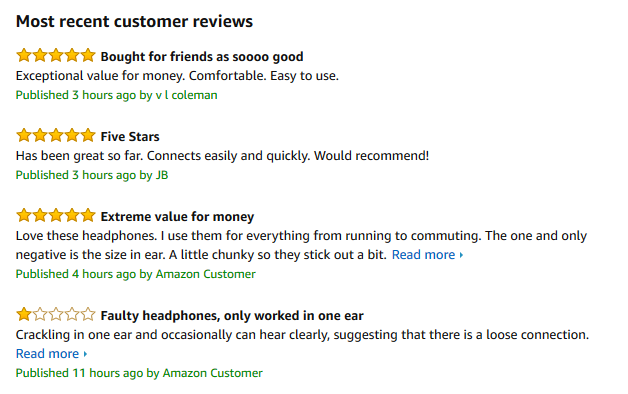

# Project-Unit-2
Outline of the project for Unit 2 using React & Redux.

# About The Project
* A page with Sign-in and Sign-up components.  
* A landing page with the products display.
* Add pagination like the picture below:

* Filtration should be added to filter through the categories of the products 
For example:

* Add items to wish list and display them in a page.
* Has a cart feature which opens up and displays the items selected in a summary, also has a checkout button.
* The cart also allows to edit the quantity of the items selected or delete them.
* Create a form which allows for “discount coupons”.
* Create forms to allow a user to select “collection” or “delivery”.
* Your total should change based on what delivery option is chosen and if a certain coupon is applied.
* When clicking on checkout button it should alerts the user that their order was successful and take them to the previous orders page where all the previous orders are displayed.
* Add an admin page where the admin can add, update and delete products.

## Bonus 
* Add review to each products with comment and star rating 

